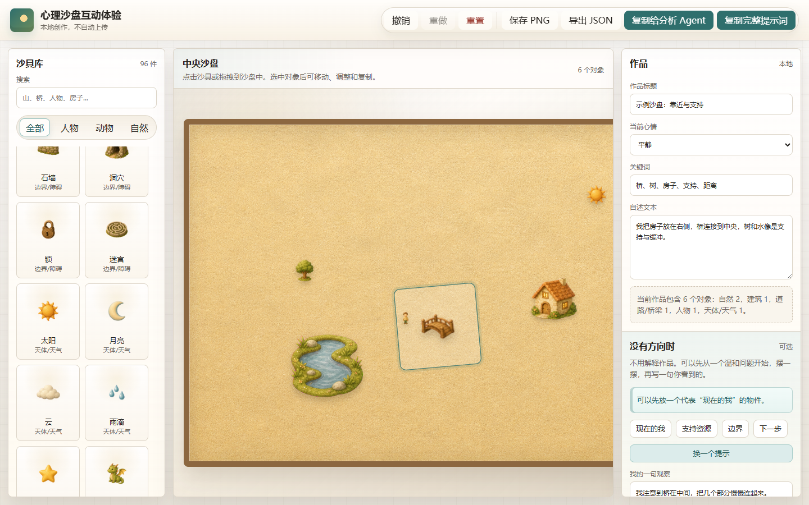
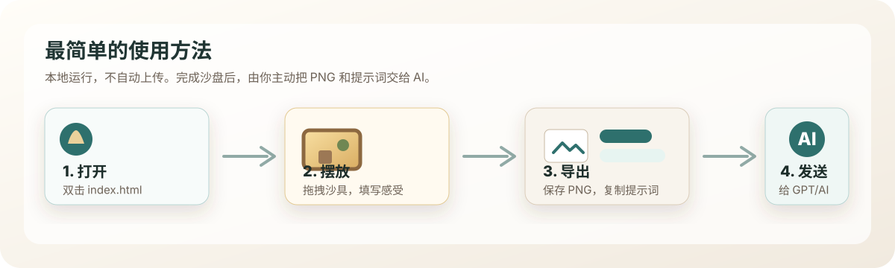

# 心理沙盒

一个可以直接在本地浏览器运行的心理沙盘互动工具。你可以选择沙具、拖拽摆放、记录当下感受，然后把沙盘截图和提示词一起交给 GPT、ChatGPT 或其他支持图片理解的 AI，获得一份非诊断式的观察与反思引导。

> 本项目用于自我表达、情绪觉察和心理教育场景，不提供心理诊断、心理治疗、医疗建议或危机干预。



## 最简单的使用方法



1. 双击打开 `sandplay-interactive/index.html`。
2. 在浏览器里摆放沙具，并按需填写作品标题、当前心情、关键词和自述文本。
3. 点击顶部工具栏的 `保存 PNG`，下载沙盘截图。
4. 点击 `复制完整提示词`。如果你已经有自己的分析提示词，也可以点击 `复制给分析 Agent`。
5. 打开 GPT、ChatGPT 或其他支持图片理解的 AI，把 PNG 图片上传，并把复制的提示词粘贴进去发送。

整个过程都在本地完成。网页不会自动上传截图、文字或布局数据。

## 如何运行

推荐方式：直接双击打开：

```text
sandplay-interactive/index.html
```

如果浏览器限制本地文件读取，或你想用本地静态服务运行：

```bash
cd sandplay-interactive
python -m http.server 8000
```

然后访问：

```text
http://localhost:8000
```

当前应用没有构建步骤，不需要后端服务、不需要数据库，也不需要 OpenAI API Key。

## 你可以用它做什么

- 在虚拟沙盘中选择、搜索、点击添加或拖拽添加沙具。
- 对沙盘物件进行移动、缩放、旋转、翻转、复制、删除、置顶和置底。
- 记录作品标题、当前心情、关键词、自述文本和一句观察。
- 主动导出沙盘 PNG、导出 JSON 布局、复制分析文本或复制完整提示词。
- 将 PNG 和提示词交给 AI，让 AI 基于截图和文字生成温和的观察报告。

## 导出内容说明

### 保存 PNG

点击 `保存 PNG` 后，会下载中央沙盘区域截图，文件名格式为：

```text
sandplay-YYYYMMDD-HHMMSS.png
```

截图只包含沙盘，不包含左右侧栏、顶部工具栏或作品文字。

### 复制提示词

- `复制完整提示词`：复制用户提交内容，并追加项目内置的完整分析 Agent 提示词。推荐直接粘贴到 GPT、ChatGPT 等 AI 中使用。
- `复制给分析 Agent`：只复制作品信息、用户自述、观察方向和安全边界。适合你已经在 AI 端配置过分析 Agent 的情况。

### 导出 JSON

点击 `导出 JSON` 后，会导出当前作品文字和沙盘对象布局。它适合存档、调试或后续二次处理；普通使用只需要 PNG 和提示词即可。

## 适用边界

适合：

- 自我表达、情绪觉察、心理教育活动后的个人反思。
- 把“难以直接说清楚的感受”先转成可观察的画面。
- 与 AI 一起获得开放式问题、画面观察和温和的下一步建议。

不适合：

- 心理诊断、心理治疗、人格判定或医疗建议。
- 危机干预或替代现实中的专业支持。
- 把 AI 的分析当作确定结论。

如果作品或对话中出现自伤、伤人、严重痛苦或现实危险，请优先联系当地紧急服务、危机热线、专业心理工作者或身边可信任的人。

## 项目结构

```text
.
├── sandplay-interactive/              # 单页前端应用
│   ├── index.html                     # 页面入口，双击即可打开
│   ├── app.js                         # 沙盘交互、导出和复制逻辑
│   ├── styles.css                     # 页面样式
│   ├── assets/                        # 沙具图片资源与 manifest
│   ├── agent-skill/                   # 分析 Agent 完整提示词
│   ├── docs/                          # 产品、安全、QA、UX 和 README 图片素材
│   └── tests/                         # Playwright 测试
├── sandplay-wide-optimized.png        # README 主界面示意图
└── start_prompt.md                    # 项目启动提示记录
```

## 开发与测试

安装依赖：

```bash
cd sandplay-interactive
npm install
```

运行测试：

```bash
npm test
```

如果本机没有 Playwright 浏览器二进制，可以先安装：

```bash
npx playwright install
```

## 隐私与安全

- 图片、文字和布局数据默认只在本地浏览器中处理。
- 保存 PNG、导出 JSON、复制文本都需要用户主动点击。
- 网页不会自动上传作品，也不会自动发送给任何 AI 服务。
- 本工具不是心理诊断、心理治疗或医疗建议工具。
- AI 的回复只能作为自我反思和心理教育参考。

## 已知限制

- 刷新页面会丢失当前作品，当前版本没有本地历史记录。
- 移动端支持基础操作，但复杂排布更适合平板或桌面浏览器。
- 撤销和重做只保存在当前页面内存中。
- 前端当前内置一组可用沙具，后续仍可扩展更多资源包和动态加载能力。
