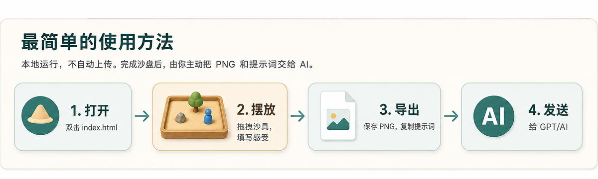

# 心理沙盘互动体验

这是项目的前端应用目录。应用是一个本地运行的单页页面，用于摆放心理沙盘、保存 PNG 截图、复制提示词，并由用户自行把截图和提示词提交给 GPT、ChatGPT 或其他支持图片理解的 AI。

> 本工具用于自我表达与情绪觉察，不提供心理诊断、心理治疗或医疗建议。

## 最短使用流程



1. 双击打开 `index.html`。
2. 在浏览器中选择沙具，拖拽或点击添加到中央沙盘。
3. 按需填写作品标题、当前心情、关键词、自述文本和一句观察。
4. 点击 `保存 PNG` 下载沙盘截图。
5. 点击 `复制完整提示词`，然后把 PNG 和提示词一起发给 GPT 等 AI。

网页不会自动上传作品，所有发送动作都由用户自己决定。

## 运行方式

直接打开：

```text
index.html
```

如果浏览器限制本地文件读取，可以启动静态服务：

```bash
python -m http.server 8000
```

然后访问：

```text
http://localhost:8000
```

基础功能不依赖后端、不依赖构建工具，也不需要真实 OpenAI API。

## 核心功能

- 沙具库：分类筛选、搜索、点击添加、拖拽添加。
- 中央沙盘：选中、移动、键盘微调、滚轮缩放和触控操作。
- 对象编辑：名称、大小、旋转、水平翻转、复制、删除、置顶、置底。
- 作品信息：标题、当前心情、关键词、自述文本、一句观察。
- 导出操作：保存 PNG、导出 JSON、复制分析 Agent 文本、复制完整提示词。
- 隐私边界：不自动上传截图、文本或布局数据。

## 保存 PNG

点击顶部工具栏的 `保存 PNG`。文件名格式为：

```text
sandplay-YYYYMMDD-HHMMSS.png
```

截图只包含沙盘区域，不包含侧栏、工具栏或作品文本。

## 复制提示词

- `复制完整提示词`：复制作品信息，并追加 `agent-skill/sandplay-analysis-agent-prompt.md` 的完整 Agent Skill 内容。推荐直接粘贴到网页端 AI 中使用。
- `复制给分析 Agent`：复制较短的提交文本，适合已经在 AI 端配置好分析 Agent 的情况。

用户需要自行将 PNG 截图和复制文本提交给外部 AI。网页不会自动发送给任何服务。

## 替换 ImageGen 资源

当前前端使用 `assets/generated/` 中的 ImageGen 生成 PNG 资源。`assets/placeholders/` 中的 SVG 仅作为 fallback/reference 保留。

替换步骤：

1. 使用 `imagegen-prompts/style-guide.md` 中的统一风格要求生成透明背景 PNG。
2. 将生成的资源放入 `assets/generated/` 或新的资源包目录。
3. 更新 `assets/manifest.json` 中对应物件的 `placeholderSrc`。
4. 需要批量补图时，按 `imagegen-prompts/supplement-generation-batches.json` 或同名 Markdown 文件执行。
5. 如需让前端直接使用更多正式资源，可在 `app.js` 的 `ASSETS` 数组中增加条目，或改为动态加载 manifest。

## 开发与测试

安装依赖：

```bash
npm install
```

运行 Playwright 测试：

```bash
npm test
```

如果本机缺少 Playwright 浏览器二进制：

```bash
npx playwright install
```

## 安全与隐私

- 本工具不是心理诊断、心理治疗或医疗建议工具。
- AI 回复只能作为自我反思和心理教育参考。
- 图片、文字和布局数据默认只在本地浏览器中处理。
- 用户需要主动下载截图、导出 JSON 或复制文本。
- 前端不会自动上传作品，也不会收集真实姓名、联系方式、年龄、病史等敏感信息。
- 若用户出现自伤、伤人、严重痛苦或危机风险，应联系当地紧急服务、危机热线、专业心理工作者或身边可信任的人。

## 已知限制

- 刷新页面会丢失当前作品，当前版本没有本地历史记录。
- 移动端支持基础操作，但复杂排布更适合平板或桌面浏览器。
- 撤销/重做保存在内存中，不会跨页面刷新保留。
- 前端内置了一组可用沙具；后续可改为动态加载完整 manifest。
